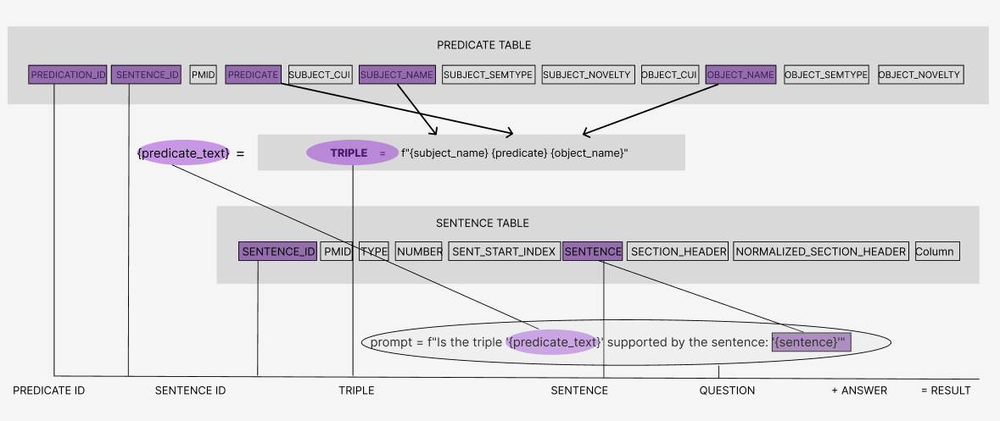
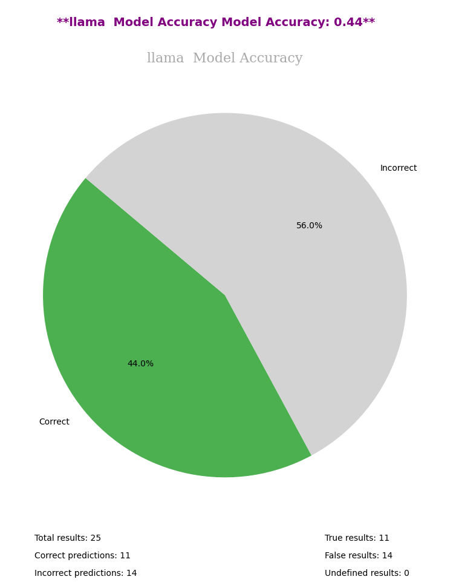
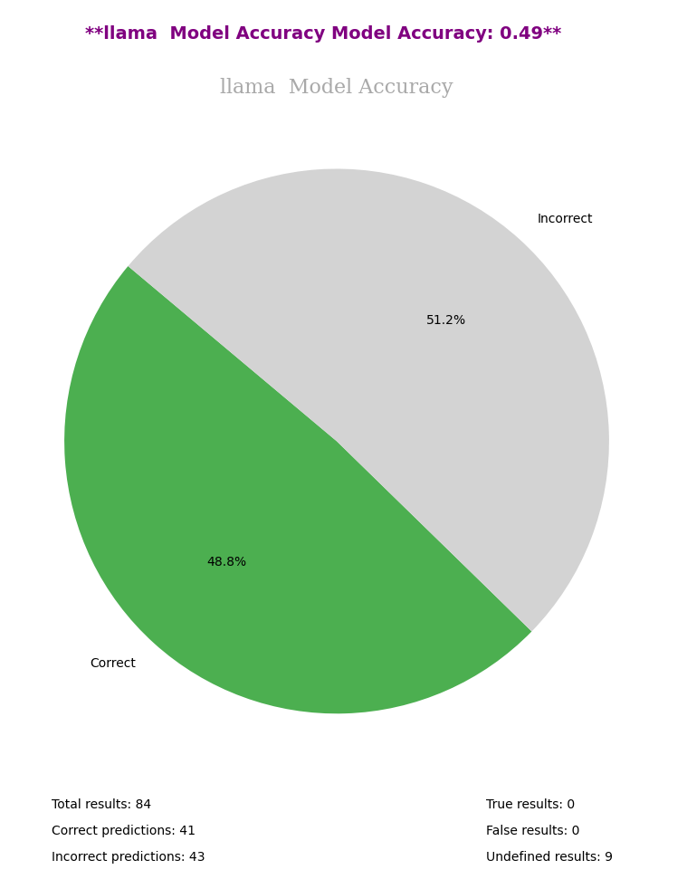
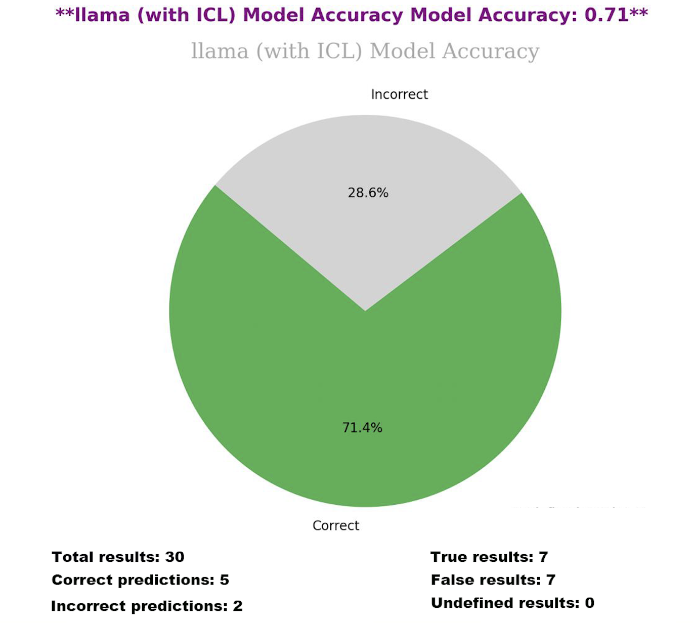
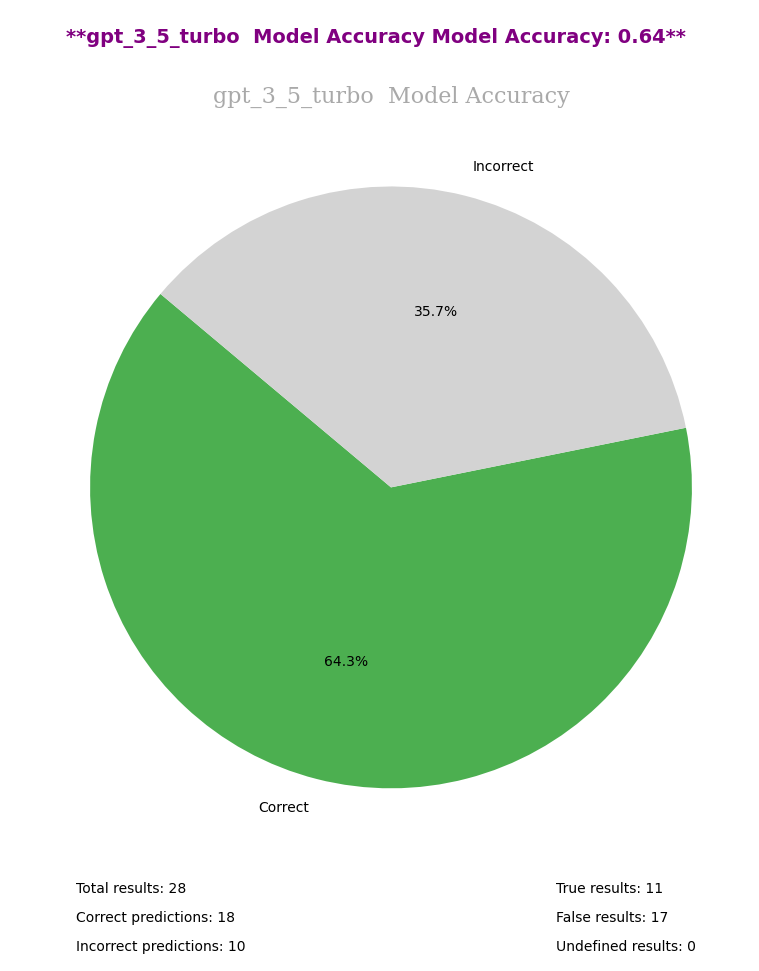
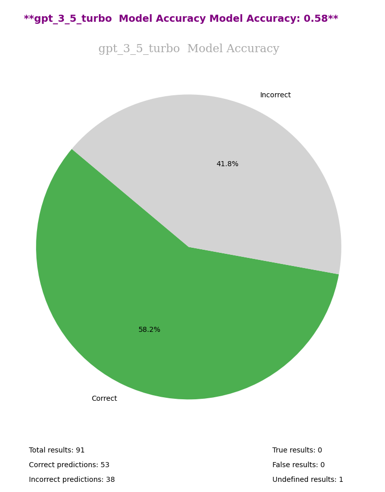
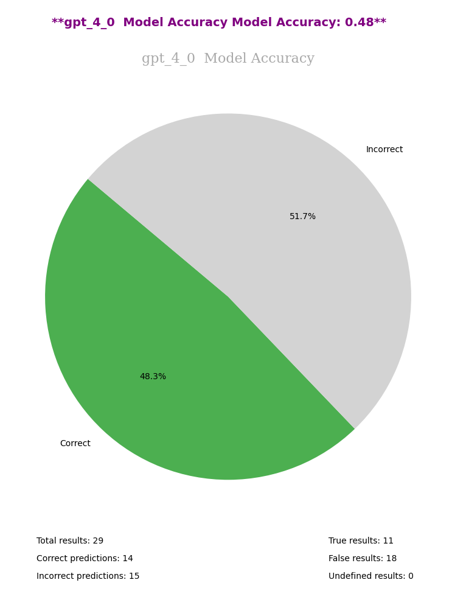
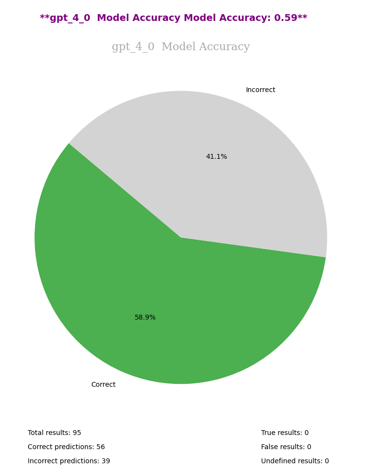
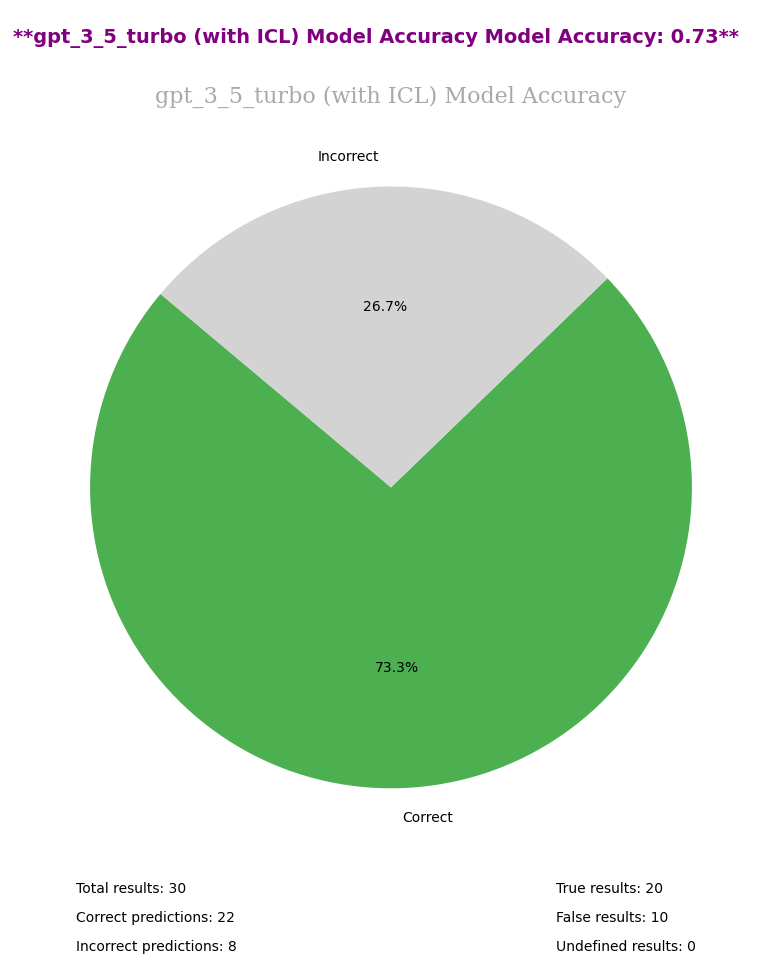
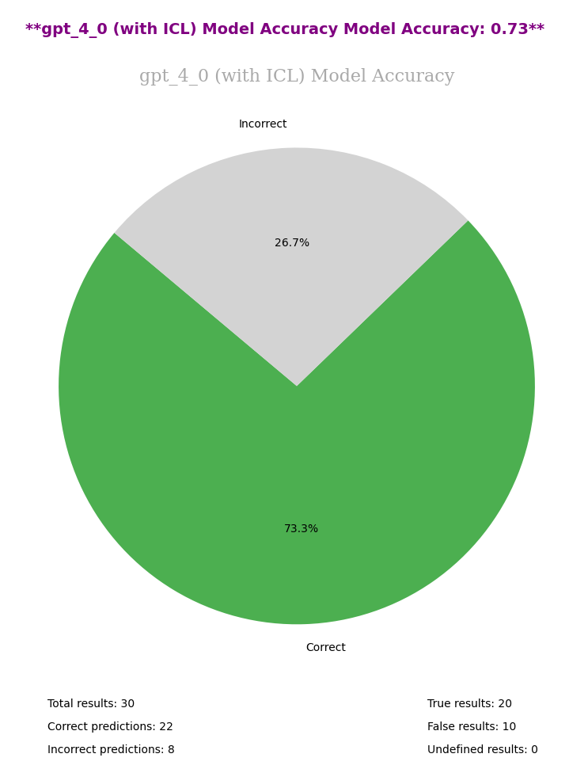

# **LLMFactCheck: Enhancing Research Quality through Advanced Triple Validation **

## **Abstract**
LLMFactCheck is an innovative tool designed to validate triples in diverse sources, thereby ensuring the accuracy of references and enhancing the quality of research. This tool leverages the power of advanced language models such as Llama2, GPT-4.0, and GPT-3.5 Turbo, both in standard and In-Context Learning modes, to process and verify information. The application is tailored to handle large datasets like SemMedDB, offering a streamlined process for fact-checking and validation. This paper describes the development, functionalities, and potential impact of LLMFactCheck on research methodologies.

## **Introduction**
The accuracy of triples (subject-predicate-object statements) in research data is crucial for maintaining the integrity of scientific knowledge. Traditional methods of triple validation often involve manual effort and are prone to errors. LLMFactCheck was developed to address these challenges, offering an automated, efficient, and reliable solution for triple validation.

## **Methodology**
LLMFactCheck integrates with leading language models like Llama2, GPT-4.0, and GPT-3.5 Turbo. It processes data from various sources, particularly focusing on the SemMedDB dataset. The tool provides an environment setup through Miniconda. It uses a command-line interface for ease of operation and includes a comprehensive testing suite to ensure reliability.

## **Workflow of LLMFactCheck**
The LLMFactCheck project is structured into several key stages:

### **1. Environment Setup and Data Loading**
- The process begins with setting up the environment using Miniconda and ensuring all necessary dependencies are installed.
- Data is loaded from specified triple and sentence files, which are crucial for the validation process.

  

### **2. Model Initialization**
- Depending on the chosen model (e.g., Llama2, GPT-4.0, GPT-3.5 Turbo) and the mode (standard or ICL), the relevant model is initialized.
- For In-Context Learning modes, additional steps are taken to prepare the model with the context derived from the training dataset.

### **3. Data Processing and Triple Validation**
- The application processes each triple against the corresponding sentence using the selected language model.
- This involves constructing prompts, generating responses from the model, and analyzing these responses to determine the correctness of triples.

### **4. Result Compilation and Output**
- The results of the validation process, including the accuracy of each triple, are compiled and stored in a structured format.
- A comprehensive result dataset is created, which includes details like predicate ID, triple text, sentence ID, and the validation outcome.

### **5. Progress Tracking**
- The application tracks the progress of the validation process, saving checkpoints to avoid redundant computations.

## **Model Accuracy Assessment in LLMFactCheck**
In LLMFactCheck, the accuracy of each model is carefully evaluated to ensure the effectiveness of triple validation. Our evaluation distinguishes between standard models and those utilizing In-Context Learning (ICL).

### **Accuracy on Different Datasets**
The accuracy assessment of models is performed on two types of datasets:
- **Test Dataset**: A subset of human-annotated data used to evaluate the models with ICL. Accuracy on this dataset reflects the model's performance in a controlled environment with a known set of triples.
- **All Labeled Dataset**: The complete set of human-annotated data, providing a broader and more comprehensive validation challenge for the standard models without ICL.

The accuracy varies depending on the dataset:
- Standard models assessed on the all labeled dataset provide a baseline accuracy, reflecting their general performance across a wide range of triples.
- Models with ICL, when assessed on the test dataset, often show improved accuracy due to the additional context provided during their training phase.

This difference in performance is crucial for understanding the models' capabilities and identifying the best application for each model type.

### **Visual Representation of Model Accuracy**
The accuracy results are visually represented through pie charts for both standard and ICL models. These charts offer an intuitive understanding of model performance in different scenarios.

  <!-- Llama Model Accuracy -->
  <figure style="text-align: center; border: 1px solid lightgrey; padding: 10px;">
    <figcaption>Llama Model Accuracy on Test Dataset</figcaption>
    
  </figure>
  <figure style="text-align: center; border: 1px solid lightgrey; padding: 10px;">
    <figcaption>Llama Model Accuracy on All Labeled Dataset</figcaption>
    
  </figure>
  <h3 style="text-align: center">Llama-2-7B-GGUF - test size = 0.3</h3>

  <!-- Llama Model Accuracy -->
  <figure style="text-align: center; border: 1px solid lightgrey; padding: 10px;">
    <figcaption>Llama Model Accuracy on Test Dataset</figcaption>
    
  </figure>

  <!-- GPT-3.5 Turbo Model Accuracy -->
  <figure style="text-align: center; border: 1px solid lightgrey; padding: 10px;">
    <figcaption>GPT-3.5 Turbo Model Accuracy on Test Dataset</figcaption>
    
  </figure>
  <figure style="text-align: center; border: 1px solid lightgrey; padding: 10px;">
    <figcaption>GPT-3.5 Turbo Model Accuracy on All Labeled Dataset</figcaption>
    
  </figure>

  <!-- GPT-4.0 Model Accuracy -->
  <figure style="text-align: center; border: 1px solid lightgrey; padding: 10px;">
    <figcaption>GPT-4.0 Model Accuracy on Test Dataset</figcaption>
    
  </figure>
  <figure style="text-align: center; border: 1px solid lightgrey; padding: 10px;">
    <figcaption>GPT-4.0 Model Accuracy on All Labeled Dataset</figcaption>
    
  </figure>

  <!-- ICL Models Accuracy -->
  <figure style="text-align: center; border: 1px solid lightgrey; padding: 10px;">
    <figcaption>GPT-3.5 Turbo Model Accuracy with ICL on Test Dataset</figcaption>
    
  </figure>
  <figure style="text-align: center; border: 1px solid lightgrey; padding: 10px;">
    <figcaption>GPT-4.0 Model Accuracy with ICL on Test Dataset</figcaption>
    
  </figure>

### **Comparative Analysis and Insights**
A significant insight from our analysis is the impact of the dataset and the application of ICL on model accuracy:
- **Llama Model**: Shows an accuracy of 44% on the test dataset and 49% on the all labeled dataset, highlighting the variability with dataset complexity.
- **GPT-3.5 Turbo**: The standard model achieves 64% accuracy on the test dataset and 58% on the all labeled dataset, whereas the ICL version significantly improves to 73% on the test dataset.
- **GPT-4.0**: This model demonstrates 48% accuracy on the test dataset and 59% on the all labeled dataset, with the ICL version reaching 73%.

These findings illustrate the benefits of ICL in enhancing accuracy and the importance of dataset selection in assessing model performance. The slight discrepancies in accuracy across different datasets underscore the need for careful dataset curation for model training and evaluation.

### **Summary of Model Accuracies**
The evaluation of model accuracies has provided the following insights:

| Model                 | Dataset Type          | Accuracy |
|-----------------------|-----------------------|---------:|
| Llama                 | test size = 0.3       |    44%   |
| Llama                 | All Labeled           |    49%   |
| Llama-2-7B-GGUF       | test size = 0.3       |    71%   |
| GPT-3.5 Turbo         | test size = 0.3       |    64%   |
| GPT-3.5 Turbo         | All Labeled (Standard)|    58%   |
| GPT-3.5 Turbo (ICL)   | test size = 0.3       |    73%   |
| GPT-4.0               | test size = 0.3       |    48%   |
| GPT-4.0               | All Labeled (Standard)|    59%   |
| GPT-4.0 (ICL)         | test size = 0.3       |    73%   |

>Llama-2-7B-GGUF - test size = 0.3
- **Llama Model Accuracy**:
  - On the test dataset: 44%
  - On the all labeled dataset: 49%

- **GPT-3.5 Turbo Model Accuracy**:
  - Standard model on the test dataset: 64%
  - Standard model on the all labeled dataset: 58%
  - With ICL on the test dataset: 73%

- **GPT-4.0 Model Accuracy**:
  - Standard model on the test dataset: 48%
  - Standard model on the all labeled dataset: 59%
  - With ICL on the test dataset: 73%

These percentages reflect the models' ability to accurately validate semantic triples, with a clear improvement demonstrated by the implementation of In-Context Learning (ICL) for both GPT-3.5 Turbo and GPT-4.0 models. It's important to note that the accuracy percentage for the standard model on the test dataset can vary depending on the subset of data randomly generated during the ICL model's training process, which emphasizes the influence of dataset composition on model performance.

### **Conclusion**
LLMFactCheck's integration of advanced language models and ICL techniques offers a nuanced approach to validating semantic triples. The comparative analysis underscores the importance of context and dataset choice in achieving high accuracy, paving the way for more sophisticated research validation tools.

## **Results**
The application successfully validates triples from SemMedDB, demonstrating high accuracy and efficiency. The results of the validation process are stored in a well-organized structure, allowing for easy review and analysis. The tool's capability to support multiple sources and its flexibility for customization make it a valuable asset for researchers and data scientists.

## **Discussion**
LLMFactCheck represents a significant advancement in the field of data validation and research methodology. Its use of advanced language models for processing triples shows a promising direction for automating complex data verification tasks. The tool's ability to integrate with various models and handle different data sources highlights its adaptability and potential for broader applications.

## **Conclusion**
LLMFactCheck offers a novel solution to the challenges of triple validation in research data. Its development marks a step forward in the integration of language models into research methodologies, promising to enhance the accuracy and reliability of scientific data. Future updates could include more language models and the ability to handle a wider range of data sources, further expanding its utility in the research community.
