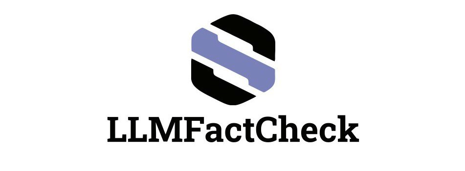

<div align="center">
  
<p>

[](https://www.python.org/downloads/release/python-3100/)
[](https://pandas.pydata.org/)
[](https://numpy.org/)
[](https://github.com/llama-ai/llama-cpp)
[](https://huggingface.co/)


</p>

<div style="background-color:#E6E6FA; padding: 2px; text-align: center;">
  <h5 style="color: black; font-size: 16px;">YOUR ONE-STOP SOLUTION FOR <strong>VALIDATING PREDICATES</strong> IN VARIOUS SOURCES.</h5>
</div>
</div>

## Project Description

The "LLMFactCheck" is a powerful tool designed to validate predicates in different sources, ensuring the accuracy of references and enhancing the quality of your research.

## Prerequisites

Before you begin, make sure you have the following installed: - [Miniconda](https://docs.conda.io/en/latest/miniconda.html)


### Essential for MacOS Users 🍏
To ensure a seamless experience, it's crucial to have GCC installed on your MacOS. https://discussions.apple.com/thread/8336714 to optimize your environment and ensure smooth operation! ✨


## Installation

### Conda Environment

To run the LLMFactCheck tool, follow these steps to set up the necessary Conda environment. Follow these steps: 🛠️

1. Make sure you have completed the Prerequisites. 

2. Clone the repository:

   ```bash
   git clone https://github.com/KoslickiLab/LLMFactCheck.git
   cd LLMFactCheck
   
3. Setup the environment for LLMFactCheck by running the setup script:

   ```bash
   bash setup.sh
   
4. Activate the Conda environment:

   ```bash
    conda activate myLLMFactCheck

# Usage (Run LLMFactCheck) 💡 
After completing the installation, you can run the LLMFactCheck tool using the following command:

   ```bash
   # Run LLMFactCheck for Semmed database
   python3 main.py --predication_file semmed_predicate.csv --sentence_file semmed_sentence.csv
   
```

## Project Structure
This part of the project follows a well-organized structure for easy navigation and management. 
Here's a quick overview:

- **main.py:** Main file that invokes the core logic.

- **src:** Contains the main code for working with the Semmed database.
  - **util:**
    - `result_writing.py`: File for writing results.
    - `data_processing.py`: File for data processing.
    - `llama_interaction.py`: File for interacting with the Llama model.
    - `progress.py`: File to track the progress of predicate validation.    

- **data:** Your data for validation.
  - `semmed_predicate.csv`
  - `semmed_sentence.csv`

- **result:** Results of Semmed predicate validation will be stored here.
  - `semmed_result_console_app.csv`


- **check:** Contains data you are checking and code for checking results.


## How It Works

1. **Run the Tool**: Execute the main script, and watch as the tool works its magic.

2. **View Results**: The results of the predicate validation process will be stored in the "result". You can review them to identify any issues with the references.

3. **Celebrate**: You've successfully checked predicates with LLMFactCheck! 🎉

Feel free to explore the source code in the "src" folder for customization or to understand the inner workings of the tool.

### New Features

- **Support for Multiple Sources**: LLMFactCheck now supports validating predicates in various sources, not limited to Semmed. You can easily extend its functionality for different datasets.

- **Console Application**: We've introduced a new console application that allows you to validate predicates in different sources using the command line. This provides more flexibility and ease of use, especially in environments where a database connection may not be available.
Enjoy using LLMFactCheck for all your predicate validation needs!


## Conclusion

LLMFactCheck simplifies the process of checking predicates in various sources. Whether you're a researcher or a data enthusiast, our tool will help you ensure the accuracy and quality of your data. Happy validating!

Please do not hesitate to contact us if you have any questions or see that the code needs to be improved.
