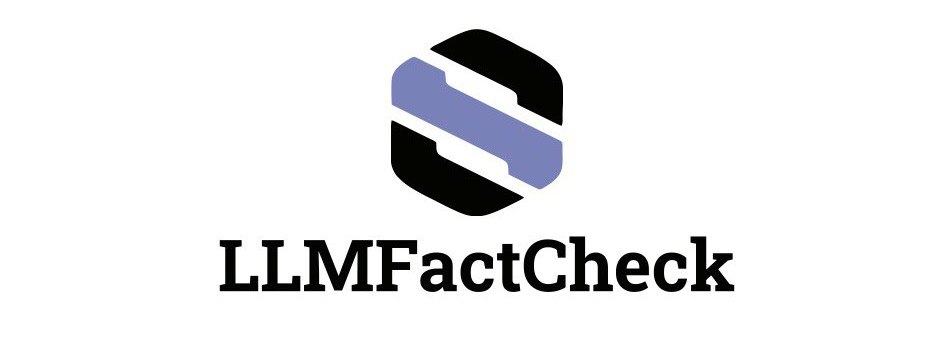

<div align="center">
  
<p>

[//]: # ([![GitHub Workflow Status]&#40;https://img.shields.io/github/actions/workflow/status/KoslickiLab/LLMFactCheck/runTest.yml&#41;]&#40;https://github.com/KoslickiLab/LLMFactCheck/actions&#41;)
[//]: # ([![codecov]&#40;https://codecov.io/gh/KoslickiLab/LLMFactCheck/graph/badge.svg?token=AZD6LBFR5P&#41;]&#40;https://codecov.io/gh/KoslickiLab/LLMFactCheck&#41;)

[//]: # ([![Quality Gate Status]&#40;https://sonarcloud.io/api/project_badges/measure?project=KoslickiLab_LLMFactCheck&metric=alert_status&#41;]&#40;https://sonarcloud.io/summary/new_code?id=KoslickiLab_LLMFactCheck&#41;)
[//]: # ([![CodeQL]&#40;https://github.com/MichaelCurrin/badge-generator/workflows/CodeQL/badge.svg&#41;]&#40;https://github.com/KoslickiLab/LLMFactCheck/actions?query=workflow%3ACodeQL "Code quality workflow status"&#41;)

[//]: # ([![License: MIT]&#40;https://img.shields.io/badge/License-MIT-green.svg&#41;]&#40;https://github.com/KoslickiLab/LLMFactCheck/blob/main/LICENSE.txt&#41;)

<!---->

[](https://sonarcloud.io/summary/new_code?id=KoslickiLab_LLMFactCheck)
[](https://codecov.io/gh/KoslickiLab/LLMFactCheck)


</p>

<div style="background-color:#E6E6FA; padding: 2px; text-align: center;">
  <h5 style="color: black; font-size: 16px;">YOUR ONE-STOP SOLUTION FOR <strong>VALIDATING PREDICATES</strong> IN VARIOUS SOURCES.</h5>
</div>
</div>

## Project Description

The "LLMFactCheck" is a powerful tool designed to validate triples in different sources, ensuring the accuracy of references and enhancing the quality of your research.

## Prerequisites

Before you begin, make sure you have the following installed: - [Miniconda](https://docs.conda.io/en/latest/miniconda.html)


### Essential for MacOS Users 🍏
To ensure a seamless experience, it's crucial to have GCC installed on your MacOS.  See [here](https://discussions.apple.com/thread/8336714).


## Installation

## Command
docker-compose up -d
docker-compose ps 

### Conda Environment

To run the LLMFactCheck tool, follow these steps to set up the necessary Conda environment. Follow these steps: 🛠️

1. Make sure you have completed the Prerequisites. 

2. Clone the repository:

   ```bash
   git clone https://github.com/KoslickiLab/LLMFactCheck.git
   cd LLMFactCheck
   
3. Create a Conda environment (if you haven't already):

   ```bash
   conda env create -f ./env/LLMFactCheck.yml

4. If you already had a Conda environment for this project and want to update it with new dependencies, execute the conda env update command with the updated environment file. Navigate to the root of your LLMFactCheck project and run the following command:

   ```bash
   conda env update -f env/LLMFactCheck.yml
   
5. Activate the Conda environment:

   ```bash
    conda activate myLLMFactCheck
   

6. Create a `.env` file in the root directory:
```plaintext
OPENAI_API_KEY='your-openai-api-key'
LANGFUSE_PUBLIC_KEY='langfuse_public_key'
LANGFUSE_SECRET_KEY='langfuse_secret_key' 
LANGFUSE_HOST='langfuse_host' 


DB_USERNAME='db_username'
DB_PASSWORD='db_password' 
DB_NAME='db_name' 
DB_HOST='db_host' 
DB_PORT='db_port' 

```

# Usage (Run LLMFactCheck) 💡 
After completing the installation, you can run the LLMFactCheck tool using the following command:
<!---->
**ChromaDB Document Creation**
   Run the following command to initialize and process documents for ChromaDB::
   ```bash
   python src/load_documents_chromadb.py
   ```

**Dataset Management & Experiment Runner**
   The pipeline now automatically checks for an existing dataset and uploads data when necessary:
   ```bash
   python src/langfuse_main.py
   ```

## Additional Scripts

### processdb.py
- Manages the database connection and cursor, loads nodes, processes edges, and provides a main entry point.
- Usage:
  ```bash
  python src/processdb.py
  ```

### kg_data_processor.py
- Defines a KGDataExtractor class for loading nodes and edges, extracting sentences, and saving processed data.
- Usage:
  ```bash
  python src/kg_data_processor.py
  ```

### kg_data_extractor.py
- Similar functionality with a KGDataExtractor class, but includes mapping of equivalent curies, sentence extraction, and saving multiple CSV outputs.
- Usage:
  ```bash
  python src/kg_data_extractor.py
  ```

### fact_check_processor.py
- Implements a DBFactChecker class connecting to a database, pulling records in batches, running a language model check, and updating the DB.
- Usage:
  ```bash
  python src/fact_check_processor.py
  ```

### extract_filtered_data.py
- Loads and filters knowledge graph data from JSONL files into CSV outputs. Also extracts relevant sentences and modifies the data accordingly.
- Usage:
  ```bash
  python src/extract_filtered_data.py
  ```

## Project Structure
This part of the project follows a well-organized structure for easy navigation and management. 
Here's a quick overview:

## 📂 Project Structure
### **data/**
- `kg2c-2.8.4-nodes.jsonl` and `kg2c-2.8.4-edges.jsonl`: Source files containing nodes and edges data for ChromaDB.

<!---->


### **env/**
- `LLMFactCheck.yml`: Conda environment configuration file.

### **json/**
- `local_items_single_3.json`: Local dataset JSON file used for uploading to Langfuse.


### **src/**
1. **`__init__.py`**  
   - Initializes the `src` module.

2. **`langfuse_config.py`**  
   - Initializes the Langfuse client for dataset operations.

3. **`langfuse_main.py`**  
   - Defines the `DatasetManager` class for managing datasets: creating, retrieving, and uploading items to Langfuse.

4. **`load_documents_chromadb.py`**  
   - Defines the `FileReader` class for reading and processing nodes and edges to create ChromaDB documents.

5. **`load_model.py`**  
   - Initializes the ChromaDB collection for indexing and querying.

6. **`logger_config.py`**  
   - Configures logging for the entire project to monitor execution steps and errors.

7. **`retrieval_rag.py`**  
   - Defines the `ChromaDBQuery` class for querying ChromaDB to retrieve relevant documents for triples.

<!---->
- chembl directory
           
      This directory contains files for testing the model's performance on the ChEMBL database. 
      It includes the `chembl_triple.py` file, which generates triples.
      If You want to try it:
      Make sure you are at the root of the project and then:
      ```bash
      cd util
      cd chembl
      python chembl_triple.py
      ```
      Then, this directory includes  the `semmed_triple_mapping.py` file, which processes the data from the semmed_triple_data.csv file, creates a new 'TRIPLE' column from this data, and then filters this data to select only those triples that match the predicates specified in the predicate-remap.yaml file. As a result, only those triples from SemMedDB that match the predicates from the yaml file are displayed, and are also written to the filtered_triple_data.csv file in the project data folder.
      If You want to try it:
      Make sure you are at the root of the project and then:
      ```bash
      cd util
      cd chembl
      python semmed_triple_mapping.py
      ```
      You don't have to do this (unless you think it's necessary), because we've already done this work and the result is already in the filtered_triple_data.py file
      <!---->

- **test:** This directory contains tests for the project. Tests help verify if the code functions correctly and identify any errors or issues.

    Running Tests:
    Make sure you are at the root of the project and then:

    To run the tests, use the following command in the terminal:
     ```bash
     pytest 
     ```
     This command will run all the tests located within the test directory.
     <!---->

  These tests utilize Python's built-in unittest.mock library to mock the file operations and csv.writer methods. This helps isolate the functions from the actual file system and ensure that the tests are repeatable and reliable. By patching the built-in open and csv.writer methods with unittest.mock.patch, we are able to simulate different scenarios and test how our functions react to them. Each test utilizes fixtures and mocks to simulate real data and code behavior. This helps ensure that the tests are reliable and repeatable.
---


## 🛡️ How It Works

1. **ChromaDB Initialization**:
   - Use `load_documents_chromadb.py` to process and index nodes and edges into ChromaDB.

2. **Langfuse Pipeline**:
   - Upload datasets using `langfuse_main.py` and validate triples with the pipeline.

3. **Run the Tool**: Execute the main script, and watch as the tool works its magic.

4. **View Results**: The results of the triple validation process will be stored in the "result". You can review them to identify any issues with the references.

5. **Celebrate**: You've successfully checked triples with LLMFactCheck! 🎉

6. **Database Interaction (processdb.py)**:
   - Manages DB connections, executes batch inserts, and prepares loaded edges and nodes.

7. **KG Data Processing (kg_data_processor.py, kg_data_extractor.py)**:
   - Extracts, filters, and converts edge/node data into CSVs (with sentence mapping and CURIE resolution).

8. **Fact Checking (fact_check_processor.py)**:
   - Connects to a DB, retrieves triples/sentences, runs them through a language model, then updates the DB with results.

9. **Filtered Extraction (extract_filtered_data.py)**:
   - Loads and filters nodes/edges from JSONL, matches them with sentences, and exports multiple CSV outputs.
---

## 🎉 New Features
1. **ChromaDB Integration**: Streamlined processes to load, query, and manage ChromaDB documents.
2. **Langfuse Dataset Management**: Automatic creation and uploading of datasets.
3. **Modular Design**: Classes and scripts are refactored for clarity and reusability.
4. **Flexible Pipeline Execution**: Multiple components to process and validate data.
5. **Support for Multiple Sources**: LLMFactCheck now supports validating triples in various sources, not limited to Semmed. You can easily extend its functionality for different datasets.

6. **Console Application**: We've introduced a new console application that allows you to validate triples in different sources using the command line. This provides more flexibility and ease of use, especially in environments where a database connection may not be available.
---


### Example Command Recap:
```bash
# Generate ChromaDB documents
python src/load_documents_chromadb.py

# Manage Langfuse datasets and run experiments
python src/langfuse_main.py
```

Happy Fact-Checking! 🎉
